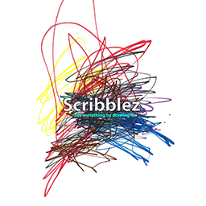

# Scribblez

### Author: Jeremy Coathup

Scribblez is essentially an HTML5 canvas drawing progressive web app. However, it runs on a nodeJS backend and also allows the user to post their images drawn to Facebook, Twitter and Google+. The app also permits the user to send drawings as email email or download them to their devices. It is quite versatile in the sense of working across platforms and devices and browser windows can be resized or device orientation changed on the fly.

Click on the icon above OR https://new-expression.herokuapp.com.

# Motivation

Built essentially as a personal project. Please be patient. Improved usability and extra features will be added soon.

# Tech

Scribblez uses:

* [JavaScript]
* [NodeJS]

# APIs

* Google+
* twitter
* Facebook

# Libraries

* express
* nodemailer
* passport

### Development

Want to contribute? Great!

### Todos

 - Write MORE Tests
 - improved usaability
 - extra features (including uploading custom backgrounds)
 - issue with redirect pop up window after user tweets image (however it still essentially works)
 - improving performance
 - improve usability on iOS
